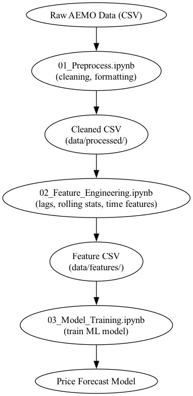

# Electricity Demand Forecasting (VIC - AEMO)

This project forecasts 30-minute electricity demand in Victoria (VIC) using historical data from AEMO. It compares traditional and machine learning approaches and includes model evaluation, feature engineering, and optional deployment using Streamlit.

## Features
- Automated download of AEMO 30-min VIC demand data
- Data cleaning and feature generation
- Multiple model comparisons (Prophet, XGBoost, etc.)
- Walk-forward validation and metrics
- Optional interactive dashboard

## Folder Structure
See the project tree below for modular organization.

## How to Run
1. Clone the repo
2. Install requirements
```bash
pip install -r requirements.txt
```
3. Run notebooks in order
4. (Optional) Launch dashboard
```bash
streamlit run forecast_app.py
```

## Data Source
AEMO NEMWeb / Energy Data Platform


Folder Structure: 

```plaintext
vic-electricity-demand-forecasting/
├── data/
│   ├── raw/
│   └── processed/
├── notebooks/
│   ├── 01_data_exploration.ipynb
│   ├── 02_feature_engineering.ipynb
│   └── 03_modeling_forecasting.ipynb
├── src/
│   ├── download_aemo_data.py
│   ├── preprocess.py
│   ├── feature_engineering.py
│   └── model.py
├── outputs/
│   ├── plots/
│   └── models/
├── requirements.txt
├── forecast_app.py
└── README.md
```

